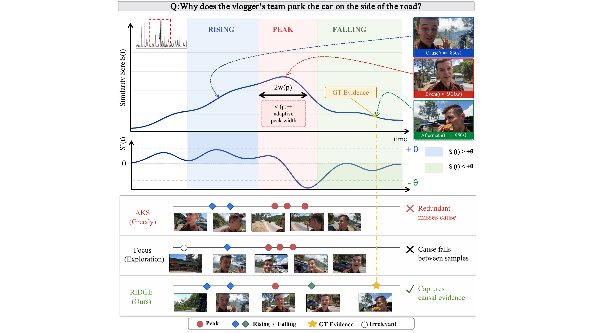
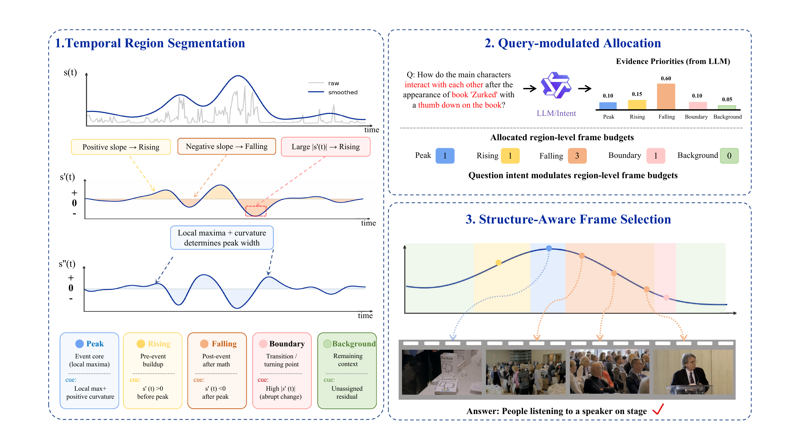
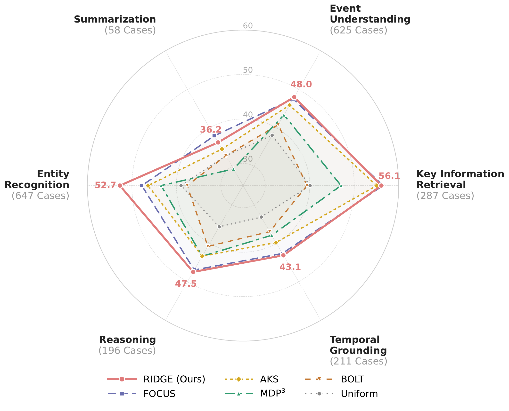
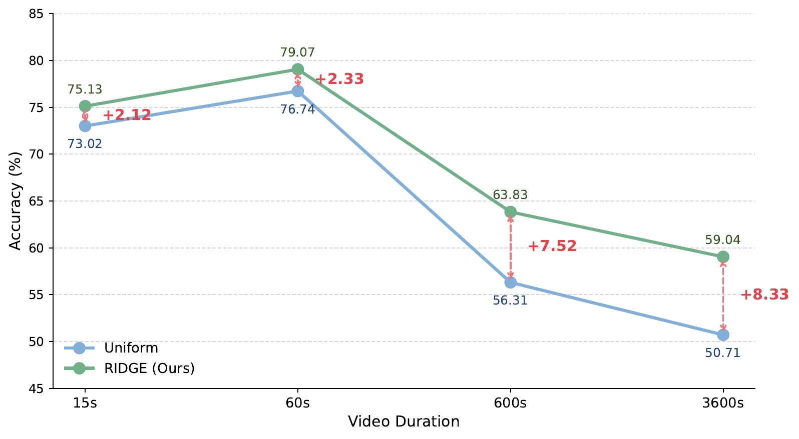

<div align="center">

# 🏔️ RIDGE

### Region-Informed Derivative-Guided Evidence Selection for Long Video Understanding

Shanqing Xu<sup>1</sup>, Meng Luo<sup>2</sup>, Mengchen Qian<sup>1</sup>, Yuhui Gao<sup>1</sup>, Siyue Peng<sup>1</sup>,  
Xiaohan Zhong<sup>1</sup>, Xiaojin Zhang<sup>1</sup>, Zhongyu Wei<sup>3</sup>, Wei Chen<sup>1</sup>, Xiang Bai<sup>1</sup>

<sup>1</sup>Huazhong University of Science and Technology · <sup>2</sup>National University of Singapore · <sup>3</sup>Fudan University

[](#citation)
[](#overview)
[](#method)
[](#installation)

[Overview](#overview) · [Highlights](#highlights) · [Quick Start](#quick-start) · [Results](#results) · [Project Structure](#project-structure) · [Citation](#citation)

</div>

## Overview

Long videos contain far more visual content than Large Vision-Language Models (LVLMs) can process under a fixed visual-token budget. Existing query-aware selectors mainly rank frames by relevance score, which can miss the buildup, transitions, and aftermath surrounding an event.

**RIDGE** treats the frame-query similarity curve as an ordered temporal signal. It uses local slope and curvature to partition the timeline into structural regions, allocates a fixed frame budget according to the question's evidence needs, and applies role-specific selection rules to preserve event cores and their surrounding context.

RIDGE is a lightweight post-processing method over precomputed frame-query scores. It requires no training and no iterative calls to the downstream LVLM.

<p align="center">
  
</p>

## Highlights

- 🏔️ **Temporal-shape-aware selection:** reads both the height and local geometry of the query-frame similarity curve.
- 🧩 **Region-specific evidence modeling:** distinguishes peaks, rising regions, falling regions, boundaries, and background context.
- 🎯 **Question-aware budget allocation:** converts question intent into a compact six-dimensional evidence-preference vector.
- ⚡ **Training-free and deterministic:** runs as lightweight CPU post-processing once frame-query scores are available.
- 📈 **Broad evaluation:** tested on Video-MME, LongVideoBench, MLVU, and LVBench with Qwen2.5-VL, InternVL3, and LLaVA-OneVision backbones.

## Method

RIDGE has three stages:

1. **Temporal region segmentation** smooths the relevance signal and uses its first and second derivatives to recover evidence roles.
2. **Query-modulated allocation** distributes the frame budget using question-specific preferences for peaks, slopes, boundaries, and context.
3. **Structure-aware frame selection** applies a matched scoring rule inside each region and restores temporal order for LVLM inference.

<p align="center">
  
</p>

## Repository Contents

- `frame_select.py`: RIDGE temporal segmentation, budget allocation, and frame selection.
- `weight.py`: multi-GPU generation of six-dimensional question evidence weights.
- `lmms-eval/`: the evaluation code used for keyframe-aware LVLM inference.
- `datasets/`: expected benchmark layout; raw videos and annotations are not included.
- `examples/`: small JSON inputs for a local RIDGE smoke test.
- `assets/`: paper figures used by this project page.

## Quick Start

### 1. Installation

```bash
conda create -n ridge python=3.10 -y
conda activate ridge
pip install -r requirements.txt
```

For end-to-end LVLM evaluation, install the included `lmms-eval` checkout as well:

```bash
pip install -e ./lmms-eval
```

Install model-specific optional dependencies as required by the selected LVLM and hardware environment.

### 2. Generate question-aware evidence weights

`weight.py` expects a JSON list whose items contain at least a `question` field. Optional fields such as `question_id`, `video_id`, `options`, and `task_type` are preserved when present.

```bash
CUDA_VISIBLE_DEVICES=0 python weight.py \
  --model-path Qwen/Qwen3-8B \
  --input-file /path/to/questions.json \
  --output-file /path/to/questions_weight6.json \
  --gpus 0 \
  --batch-size 8 \
  --append-options \
  --trust-remote-code
```

Each output item contains weights in `[0, 10]` for:

```text
peak_similarity, slope_abs, rising_slope,
falling_slope, boundary_change, context_density
```

### 3. Select frames with RIDGE

Prepare three aligned JSON lists:

- `scores.json`: one frame-query similarity sequence per example.
- `frames.json`: the corresponding frame indices or frame identifiers.
- `weights.json`: the six-dimensional weight dictionaries generated above.

```bash
python frame_select.py \
  --dataset_name longvideobench \
  --extract_feature_model blip1 \
  --score_path /path/to/scores.json \
  --frame_path /path/to/frames.json \
  --query_path /path/to/weights.json \
  --output_file /path/to/selected_frames \
  --max_num_frames 32 \
  --sigma 2.0
```

The selected frame lists are written to:

```text
<output_file>/<dataset_name>/<extract_feature_model>/selected_frames_GradSelect.json
```

### 4. Run the included smoke test

```bash
python frame_select.py \
  --dataset_name demo \
  --extract_feature_model blip2 \
  --score_path examples/sample_scores.json \
  --frame_path examples/sample_frames.json \
  --query_path examples/sample_weights.json \
  --output_file outputs \
  --max_num_frames 4
```

## Dataset Preparation

RIDGE was evaluated on four long-video QA benchmarks. Download each dataset from its official source and place raw videos and annotations under `datasets/`. See [`datasets/README.md`](datasets/README.md) for the expected directory layout.

Large videos, model checkpoints, generated features, and experiment outputs are intentionally excluded from version control.

## Results

The table below summarizes the Qwen2.5-VL-7B results at a 32-frame budget reported in the paper.

| Method | Video-MME | LongVideoBench | MLVU | LVBench |
|:--|---:|--:|--:|--:|
| Uniform sampling | 61.2 | 58.9 | 59.7 | 38.5 |
| **RIDGE** | **63.7** | **65.4** | **69.6** | **50.9** |
| Improvement | **+2.5** | **+6.5** | **+9.9** | **+12.4** |

<p align="center">
  
  
</p>

## Project Structure

```text
RIDGE/
├── assets/                 # README figures
├── datasets/               # Dataset layout (raw data excluded)
├── examples/               # Minimal smoke-test inputs
├── lmms-eval/              # Keyframe-aware LVLM evaluation code
├── frame_select.py         # RIDGE selection algorithm
├── weight.py               # Question weight generation
├── requirements.txt
└── README.md
```

## Citation

If RIDGE is useful in your research, please cite the paper. The public paper identifier will be added here when available.

```bibtex
@inproceedings{xu2026ridge,
  title     = {RIDGE: Region-Informed Derivative-Guided Evidence Selection for Long Video Understanding},
  author    = {Xu, Shanqing and Luo, Meng and Qian, Mengchen and Gao, Yuhui and Peng, Siyue and Zhong, Xiaohan and Zhang, Xiaojin and Wei, Zhongyu and Chen, Wei and Bai, Xiang},
  booktitle = {Proceedings of the 2026 Conference on Empirical Methods in Natural Language Processing},
  year      = {2026}
}
```

## Acknowledgements

The evaluation pipeline is built on [lmms-eval](https://github.com/EvolvingLMMs-Lab/lmms-eval). Please also follow the original project licenses and citation requirements.
